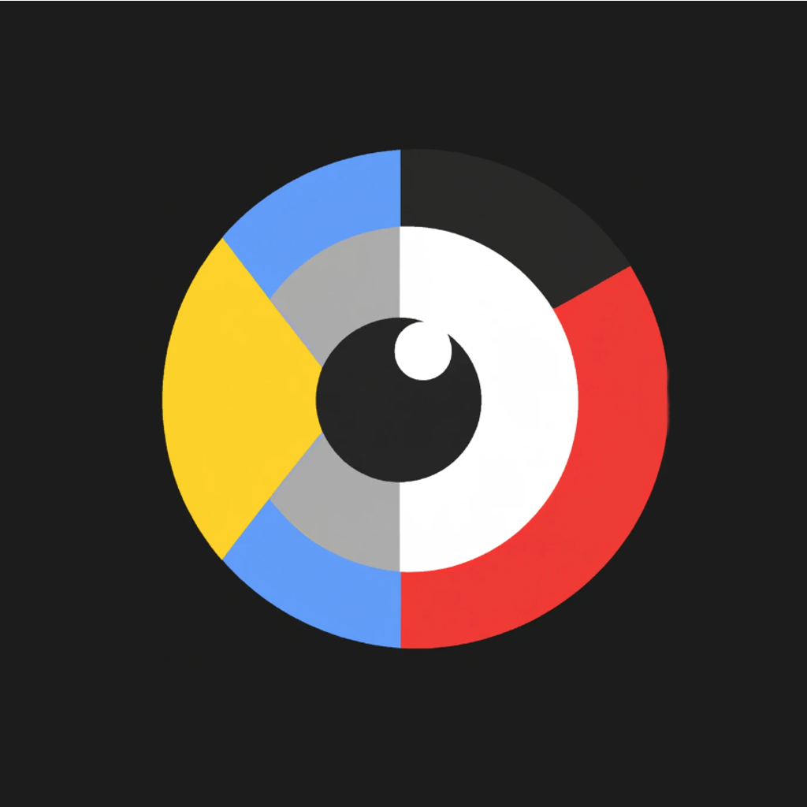

<br />
<div align="center">
  <a >
    
  </a>

  <h3 align="center">Vertex Search - AI CBIR (Image Search)</h3>

  <p align="center">
    🤖 <a href="https://en.wikipedia.org/wiki/Content-based_image_retrieval#:~:text=%22Content%2Dbased%22%20means%20that,derived%20from%20the%20image%20itself.">Content-based Image Recognition Simplified.</a>
    <br />
    <a href="https://github.com//Samuel-Hinchliffe/Chess.com-analyser"><strong>Explore the docs »</strong></a>
    <br />
    <br />
  </p>
</div>


# About 
Have you ever wondered how reverse image searches work and how machines can find patterns in images? <a href="https://en.wikipedia.org/wiki/Content-based_image_retrieval#:~:text=%22Content%2Dbased%22%20means%20that,derived%20from%20the%20image%20itself.">Content-based Image Recognition.</a> is what's often used to achieve this. 

<a href="https://en.wikipedia.org/wiki/Content-based_image_retrieval#:~:text=%22Content%2Dbased%22%20means%20that,derived%20from%20the%20image%20itself.">Content-based Image Recognition </a> allows machines to analyze the visual content of images and identify patterns and similarities. It's like when you upload a picture to a reverse image search engine and it magically finds other images that are similar or related. This is done by extracting features from the uploaded image, such as shapes, colors, textures, and patterns, and comparing them to features of other images in a database.

This project does this in a simple manner you can use to learn from. 
## 💻 Usage
```console
1. Put your images (The ones you want to show the user when they upload an image) into the 'static/dataset' directory.
2. pip install -r requirements.txt
3. python image_feature_extractor.py (This will preprocess your images from .2)
4. python image_search_app_server.py (This will start the flask server)
```